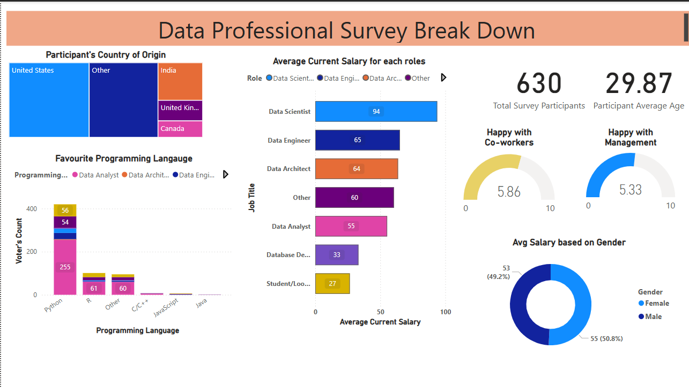

# Data Professional Survey Dashboard Project - Power BI

## Overview
This project is a personal work of mine as part of my Power BI learning journey. This happens to be my first Power BI visualization. Since, its my first visualization in Power BI and iam not confident enough to do it myself at the time, i followed the guided video by Alex the analyst from Youtube. Link: https://www.youtube.com/watch?v=pixlHHe_lNQ&list=PLUaB-1hjhk8FE_XZ87vPPSfHqb6OcM0cF&index=41. Nevertheless, this dashboard is one of my many dashboards that followed during the course of my learning. Stay tuned!!!

## Dataset
- **Source**: This dataset is a direct excerpt from the description of Alex the Analyst Power BI guided project. 
link: https://www.youtube.com/redirect?event=video_description&redir_token=QUFFLUhqbmpnMG9FZFczckV1N2VzSGRSaUFvdXc5Z0xqZ3xBQ3Jtc0tuWlZKdUVmTDNNQzFtZ0NpWXFXLWZrZjhTQ3owNU9QdVdSZGtqMjhhTnpPbXVUcnd4OHpiU3BjU2EtMXF3a1JCakhwa3BCVlBSOWVZaDU5c0p6S1FJaWQ0Rzdqdk9PbGl6TWtoRkRiZUwtVVRIM2Y3cw&q=https%3A%2F%2Fgithub.com%2FAlexTheAnalyst%2FPower-BI%2Fblob%2Fmain%2FPower%2520BI%2520-%2520Final%2520Project.xlsx&v=pixlHHe_lNQ. This dataset is a real survey of data professionals from different countries. It consists of 630 records. The attributes include participant's demographics and how happy they are with their current data professional role.

- **Tables Used**: Just one table with 630 records with attributes - Unique ID, Email, Date Taken (America/New_York), Time Taken (America/New_York),Browser,OS, City, Country, Referrer, Time Spent, Q1 - Which Title Best Fits your Current Role?, Q2 - Did you switch careers into Data?, Q3 - Current Yearly Salary (in USD), Q4 - What Industry do you work in?, Q5 - Favorite Programming Language,	Q6 - How Happy are you in your Current Position with the following? (Salary),Q6 - How Happy are you in your Current Position with the following? (Work/Life Balance), Q6 - How Happy are you in your Current Position with the following? (Coworkers), Q6 - How Happy are you in your Current Position with the following? (Management), Q6 - How Happy are you in your Current Position with the following?(Upward Mobility), Q6 - How Happy are you in your Current Position with the following? (Learning New Things), Q7 - How difficult was it for you to break into Data?, Q8 - If you were to look for a new job today, what would be the most important thing to you?, Q9 - Male/Female?, Q10 - Current Age, Q11 - Which Country do you live in?, Q12 - Highest Level of Education, Q13 - Ethnicity

- **Columns of Interest**: 
    - Unique ID,
    - Date taken(America/NewYork),
    - Q1 - Which Title Best Fits your Current Role?,
    - Q3 - Current Yearly Salary (in USD),
    - Average Salary- new measure,
    - Q4 - What Industry do you work in?,
    - Q5 - Favorite Programming Language,
    - Q6 - How Happy are you in your Current Position with the following? (Salary),
    - Q6 - How Happy are you in your Current Position with the following? (Work/Life Balance),
    - Q6 - How Happy are you in your Current Position with the following? (Coworkers),
    - Q6 - How Happy are you in your Current Position with the following? (Management),
    - Q6 - How Happy are you in your Current Position with the following?(Upward Mobility),
    - Q6 - How Happy are you in your Current Position with the following? (Learning New Things),
    - Q7 - How difficult was it for you to break into Data?,
    - Q8 - If you were to look for a new job today,
 what would be the most important thing to you?,
    - Q9 - Male/Female?,
    - Q10 - Current Age,
    - Q11 - Which Country do you live in?,
    - Q12 - Highest Level of Education, Q13 - Ethnicity

## Features / Visuals
This dashboard is a single page report with four key indicators.

1) Total Survey Participants
2) Participant's averahge age
3) Happiness index with Co-workers
4) Happiness index with Management

Viewer can filter the dashbard between participant's country of origin using tree map chart in the dashboard.

Finally three different charts showing participant's programming language rolewise, Avg current salary for each role and avg salaruy based on gender.

## Technologies Used
- Power BI Desktop / Power BI Service
- DAX
- Power Query (M language)

## How to Use
Instructions on how to:
- Open the `.pbix` file (if shared)
- Dashboard link: https://app.powerbi.com/groups/fce62c63-759b-49fe-b52d-e588e3cc71b9/reports/960aee47-8004-403c-af19-7c4457d222a8/d1cf46109c3d2d681016?experience=power-bi

