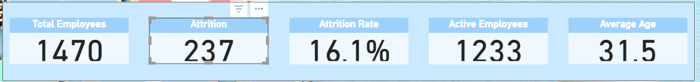
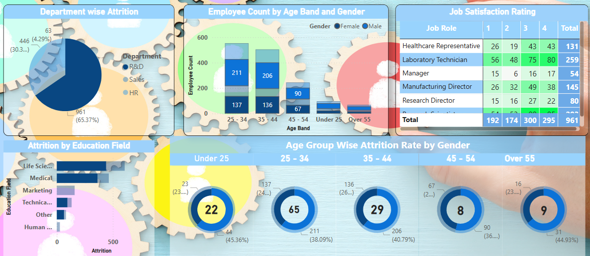
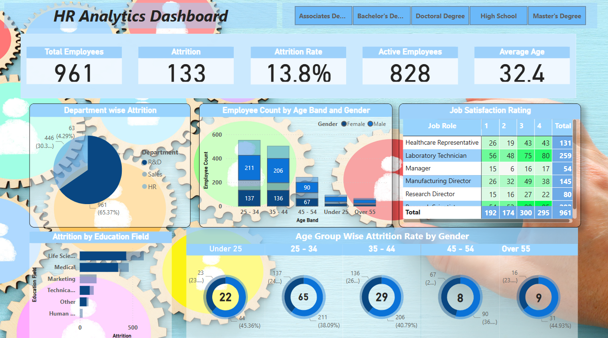

# HR Dashboard Project - Power BI

## Overview
This projevt aims to create a comprehensive dashboard for human resources department. Through this visualization, i aim to draw insights in HR department on employee's performance and keep track of organization's work force.

## Dataset(s)
- **Source**: https://docs.google.com/spreadsheets/d/17zaiJnUOnLdHROWLZYcVlpMJ08wh-Bou/edit?gid=115883679#gid=115883679
- **Columns of Interest**: Attrition, CF_ageband,CF_attrition label, Department, Education Field, emp no, Employee Number, Gender, Job Role, Marital Status, Environment Satisfaction, Hourly Rate, Job Involvement, Job Level, Job Satisfaction, Monthly Income, Monthly Rate, Num Companies Worked, Percent Salary Hike, Performance Rating, Relationship Satisfaction, Standard Hours, Stock Option Level, Total Working Years, Work Life Balance, Years At Company, Years In Current Role, Years Since Last Promotion, Years With Curr Manager.

## Features / Visuals
- **Key Indicators:**
    - Total Employees
    - Attrition : counted the number of records with attrition = Yes. had to create a column Attrition count with values 1 for Yes and 0 for NO so that we can just sum(Attrition_count) to find Attrition value
    - Attrition Rate: sum(Attritin_count)/ count(Employee_number) and then format to percentage
    - Active Employees: (total employees - attrition)
    - Employee's Average Age

        

- **Visualizations:**
    - Department wise Attrition - A pie chart
    - Total Employees based on age band and gender - Stacked column chart
    - Job Satisfaction rating: Employees whi voted the highest are highlighted in green - a table with highlighted records.
    -  Attrition by Education field - a clustered bar chart
    - Age group wise attrition rate by gender - donut charts with cards to show attrition rate

        

- **Filtering**:
User has the option to filter employees based on their on level of education.
    

## Overall Canvas: 

## Key Insights
- Employees with only high school diploma have highest Atttrition rate of 18.1% which is expected from any organization.(they always look for skilled work force). Also note that these people have lowest average age.
- Attritionin departments: R&D > HR> Sales 
- More than 50% of employees are aged < 44
- Life Sciences and Medical fields have highest Attrition.
- When compared to females, males have been part of terminations in all age groups pointing out organization's pro activeness in hiring women work force.

## Technologies Used
- Power BI Desktop / Power BI Service
- DAX
- Power Query (M language)

## How to Use
Instructions on how to:
- Open the `.pbix` file (if shared)
- dashboard link: https://app.powerbi.com/groups/me/reports/95efd4aa-9c94-4764-add7-e5b46dfc9117/bb40846f41cc249add05?experience=power-bi

