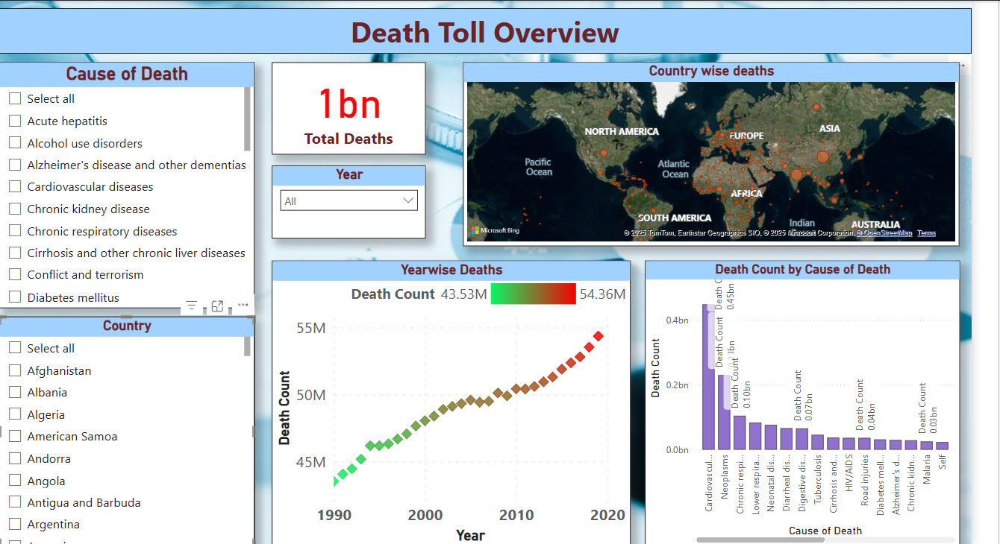

# HealthCareAnalytics - DeathTollOverview

## Overview
This project gives us the overview on death in each country and their causes from the year 1990 to 2019. Thsi project involves rigorous data cleaning and post cleaning the data is quite small and has limited potential to draw inisghts. Nevertheless, we can come to some conclusions based on the causes of death and take action in the future to avoid these.

## Dataset(s)
- **Source**: kaggle. link: https://www.kaggle.com/datasets/prasad22/healthcare-dataset

    This synthetic healthcare dataset has been created to serve as a valuable resource for data science, machine learning, and data analysis enthusiasts. It is designed to mimic real-world healthcare data, enabling users to practice, develop, and showcase their data manipulation and analysis skills in the context of the healthcare industry.
- **Tables Used**: Everything except Number of Executions column.
- **Columns of Interest**: The data is cleaned and unpivoted to make a new column called causes of death that is of most interest to visualize data better.

## Features / Visuals

Single page visualization with options to select cause of death, country and year to analyze data with three visualizations.

    - Country wise deaths in a map: Countries with highest deaths are highted in large bubbles.
    - Yearwise deaths
    - Death count based on death causes.

## Key Insights
- Obviously, countries with highest population like China and India recorded highest deaths.
- Most people die of cardio vascular diseases followed by Neoplasms and Chronic respiratory diseases. 
- A total of 1 billion deaths happened in last 3 decades.

## Technologies Used
- Power BI Desktop / Power BI Service
- DAX
- Power Query (M language) (if applicable)

## How to Use
Instructions on how to:
- Open the `.pbix` file.
- Link: https://app.powerbi.com/groups/me/reports/9cfadda0-cba6-4a41-b339-fd26d4b12f35/62174ba0e4d2f20db2c6?experience=power-bi

