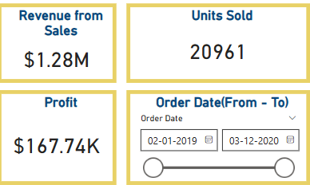
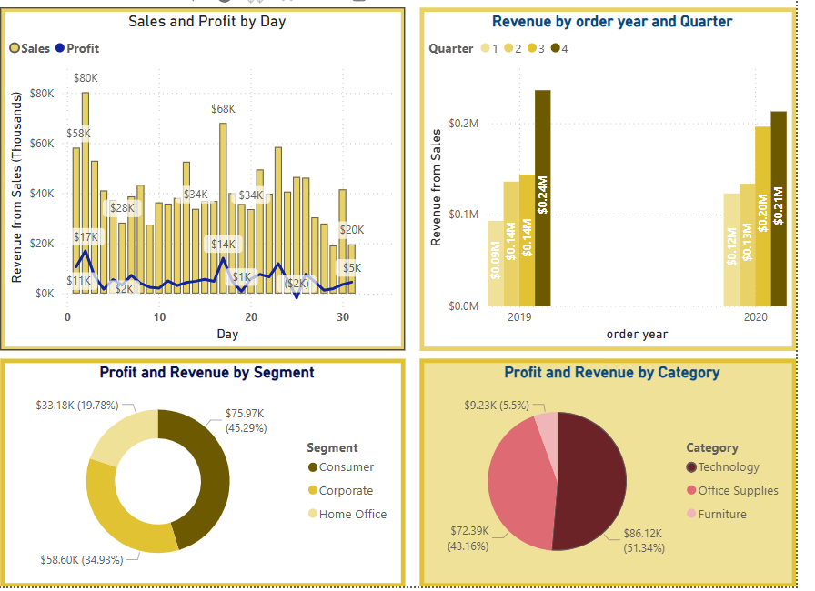
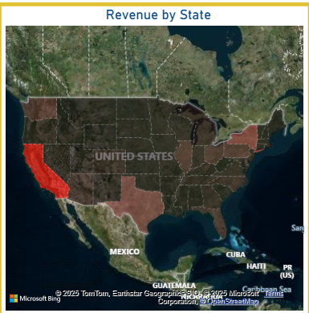
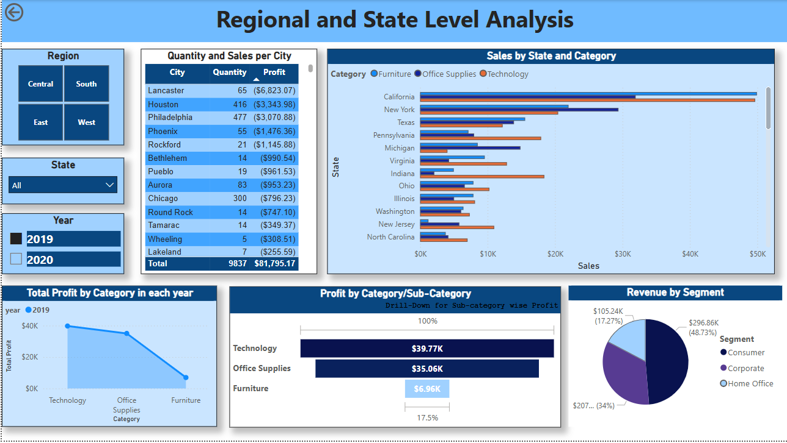

# Super Store Sales Dashboard Project - Power BI

## Overview
This project aims to create a dashboard for sales for Super store. For ease of visualization, this dashboard is made with two pages. The first page is over all sales focussed and the second page is sales focussed solely on region and state. This project is my second work in my Power BI learning journey. 

## Dataset(s)
- **Source**: This dataset is downloaded from Kaggle website. Link: https://www.kaggle.com/code/aaronlikevis/superstore-data-visualization-with-power-bi. 
- **Tables Used**: The dataset only involves the Orders excel, which contains the data about the superstore product orders in the US from 2019 - 2020. The table also contains order information like customer name, product details, and shipping address.
- **Columns of Interest**: Sales and profit related columns are of our interest which are used to draw the visualizations.

## Features / Visuals
### Page-1: Sales Overview

This page consists of three KPIs.
- Revenue from sales
- Total units sold
- Profit

In addition to above three, user also have the option select between dates from 2019 - 2020
    

This page also consists of five visualizations related to sales and profit made based on 

1. Order month - Here used have the option to drill down to any day in the month.(line and stacked column chart)

2. Segment: three segments - (donut chart)
    - Consumer
    - corporate
    - Home office

3. Order year and quarter(bar chart)

4. Category(pie chart): three categories
    - Technology
    - Office supplies
    - Furniture
5. A map showing revenue by state. In the map, states with highest revenue are highlighted in red.

    
    

### Page-2: Region and state analysis
This page gives user options to select from region(central, south, east, west), state(all 50 sates from USA) and year(2019 or 2020).

Coming to the visualizations, there are five.
1. Quantity and sales per city
2. Sales by staet and category.
3. Profit by category in each year.
4. Profit by category/sub-category: gives user option to drill odwn to sub-category.
5. Revenue by segment.

    

## Key Insights
- California state has the highest sales followed by New York, Washington and Texas.
- There is a 26% of growth in revenue for the year 2020 when compare dto previous year.
- Consumer segment and technology category made up most of sales revenue. 
- Revenues generated are highest in quarter 4 in both years. Also note that, profit dropped significantly in 2nd quarter.
- States with highest sales in each region
    - Central - Texas
    - South - Florida
    - East - New York
    - West - California

## Technologies Used
- Power BI Desktop / Power BI Service
- DAX
- Power Query (M language)

## How to Use
Instructions on how to:
- Open the `.pbix` file (if shared)
- Link to dashboard: https://app.powerbi.com/groups/me/reports/4516566e-d118-467d-b77f-9dc00ead8be5/fea706a9bc0cb62b9fa2?experience=power-bi

